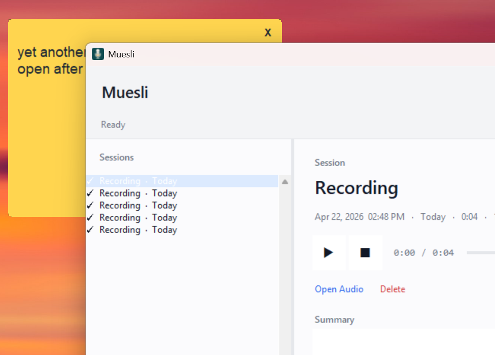

# Muesli

Muesli is a local-first audio recorder, transcription app, and batch transcription tool.
It is inspired by Granola's workflow, but it is not a full Granola clone.

It can:

- record from your microphone
- transcribe speech locally with Whisper
- summarize transcripts with a local GGUF model or an optional API fallback
- process existing audio files in batch
- write sidecar `.txt` and `.silent` files for downstream tooling

The current repo is Windows-first, but the core Python code also runs on Linux with the right audio and model dependencies.




## Why This Repo Exists

Muesli started as a local meeting recorder and evolved into a practical transcription tool for poor-quality real-world audio, shared audio folders, and sidecar-based workflows.

The repo currently includes:

- a desktop GUI recorder: `muesli_gui.py`
- a reusable Python API: `muesli.py`
- a batch transcriber for `2026-*` style audio drops: `muesli_batch_transcribe.py`
- a Windows global hotkey listener: `muesli_hotkey.py`

## Current Status

The project is usable, but it is still a working tool rather than a polished packaged product.

- Windows setup is the best-supported path right now.
- The batch transcription workflow is production-useful.
- The GUI and launcher path are functional, but still evolving.
- There is no installer package or release build in this repo yet.
- The app intentionally focuses on local recording, local transcription, and shared-folder workflows instead of trying to match Granola feature-for-feature.

## Granola Comparison

This project borrows some UX and workflow ideas from Granola, but it is narrower in scope. Granola's current product includes calendar-aware meeting capture, templates, recipes, workspaces, integrations, and mobile sync. Muesli currently focuses on local recording, local transcription, local summaries, and file-based batch processing.

The table below is based on Granola's public docs for [transcription](https://docs.granola.ai/help-center/taking-notes/transcription), [calendar sync](https://docs.granola.ai/help-center/getting-started/syncing-your-calendars), [templates](https://docs.granola.ai/help-center/taking-notes/customise-notes-with-templates), [recipes](https://docs.granola.ai/help-center/getting-more-from-your-notes/recipes), [workspaces](https://docs.granola.ai/help-center/workspaces), [integrations](https://docs.granola.ai/help-center/sharing/integrations/integrations-with-granola), and [iPhone sync](https://docs.granola.ai/help-center/ios/syncing-with-desktop).

| Feature | Granola | Muesli | Notes |
| --- | --- | --- | --- |
| Local desktop recorder | Yes | Yes | Both have a desktop capture workflow. |
| Live transcript view | Yes | Partial | Muesli shows live transcript while recording, but its UX is simpler. |
| Mic + system audio capture separation | Yes | No | Granola distinguishes your mic from system audio on desktop. Muesli is mic-first and batch-file oriented today. |
| Calendar-aware upcoming meetings | Yes | No | Granola syncs Google and Outlook calendars. Muesli does not. |
| Quick ad-hoc notes | Yes | Yes | Granola has Quick Note; Muesli can start a manual recording immediately. |
| AI-enhanced notes / summaries | Yes | Yes | Muesli can summarize locally with GGUF or via optional API fallback, but Granola's note-generation workflow is more advanced. |
| Template-based note regeneration | Yes | No | Granola supports desktop templates and re-generation. Muesli currently uses a single editable prompt. |
| Saved prompt recipes / chat over notes | Yes | No | Granola exposes recipes and cross-note chat. Muesli does not yet. |
| Shared workspaces and folders | Yes | No | Muesli currently uses filesystem conventions rather than multi-user workspaces. |
| Web sharing and collaboration | Yes | No | Granola supports shared links and folder collaboration. |
| Integrations (Slack, Notion, CRM, Zapier, MCP, API) | Yes | No | Muesli currently integrates through files and scripts rather than productized SaaS integrations. |
| iPhone capture and desktop sync | Yes | No | Muesli is desktop-only today. |
| Local batch transcription from shared folders | No | Yes | This is one of Muesli's strongest workflows. |
| Sidecar transcript and no-speech markers | No | Yes | Muesli writes `.txt` and `.silent` files for race-free downstream processing. |
| Fully local audio retention | Partial | Yes | Granola states it uses a transcription provider and does not save audio. Muesli keeps audio and transcripts locally under your control. |

## Features

- Local recording at 16 kHz mono
- Local transcription with `faster-whisper`
- Optional local summarization with `llama-cpp-python`
- Optional Anthropic fallback if you configure an API key yourself
- Batch processing of existing audio files
- Sidecar output convention:
  - `slug.txt` for detected speech
  - `slug.silent` for processed audio with no useful speech
- Windows global hotkey support for launch-and-record

## Quick Start

### Windows

```powershell
git clone https://github.com/joshwhitk/Muesli.git
cd Muesli
setup_windows.bat
```

That script:

- creates `.venv`
- installs Python dependencies
- checks for `ffmpeg`
- creates desktop and startup shortcuts

After setup, launch the app with the desktop shortcut or run:

```powershell
.venv\Scripts\python.exe muesli_gui.py
```

### Linux

Linux is manual setup at the moment:

```bash
git clone https://github.com/joshwhitk/Muesli.git
cd Muesli
python3 -m venv .venv
source .venv/bin/activate
pip install --upgrade pip
pip install -r requirements.txt
```

You will usually also want:

```bash
sudo apt install ffmpeg portaudio19-dev
```

Then run:

```bash
python muesli_gui.py
```

## Batch Transcription Workflow

The batch transcriber is designed for shared audio directories and poor-quality recordings.

Typical convention:

```text
2026-04-15_18-21-46.wav    recording
2026-04-15_18-21-46.txt    transcript with speech
2026-04-15_18-21-46.silent processed, no useful speech
```

The local mirror under `outputs/sidecars/` is intentionally ignored by Git.

## Configuration

Runtime configuration lives in `config.json` and is not committed.

Common fields:

```json
{
  "shared_dir": "C:\\Users\\<you>\\Documents\\MuesliData\\analytics\\audio",
  "launch_hotkey": "Ctrl+Shift+`",
  "whisper_quality": "high",
  "whisper_model": "large-v3",
  "whisper_device": "auto"
}
```

Notes:

- `shared_dir` controls where exported audio and sidecar files go.
- `launch_hotkey` is used by the Windows hotkey listener.
- `whisper_quality` is the user-facing preset shown in Settings.
- `whisper_model` and `whisper_device` are the underlying Whisper runtime choices.

## Models

### Whisper

Whisper is provided by `faster-whisper`. The model is downloaded and cached automatically on first use.

- `High Quality` uses `large-v3`
- `Fast` uses `medium`
- New installs default to `High Quality` when there is at least 20 GB of free disk space on the local user drive
- On Windows with an NVIDIA GPU, `setup_windows.bat` also installs the CUDA runtime packages needed for GPU Whisper

### Local summarization model

If you want local summarization, place a GGUF model in `models/`.

Example options:

- Phi-3.1-mini Q4
- Mistral 7B Instruct Q4
- another small instruction-tuned GGUF that works with `llama-cpp-python`

If no local summary model is available, the code can fall back to Anthropic if you provide an API key in `config.json`.

### Ollama on Windows

When Muesli uses Ollama for summaries, the GPU-heavy work runs inside the global Ollama service (`ollama.exe` / `ollama.exe runner`), not inside the Muesli process itself.

- Task Manager will usually show that work as `ollama.exe`, not as `Muesli`
- Muesli cannot reliably rename those processes or force Task Manager to group them under Muesli without changing the execution model
- The practical fix is better in-app visibility: show the active backend, model, and runtime status clearly inside Muesli

## Windows Hotkey

Muesli ships with a small background listener on Windows so the launch-and-record shortcut works system-wide.

Current default:

```text
Ctrl+Shift+`
```

This is handled by `RegisterHotKey`, so it works across normal desktop apps and is not limited to Explorer shortcut hotkeys.

## Development

### Basic setup

```powershell
python -m venv .venv
.venv\Scripts\python.exe -m pip install --upgrade pip
.venv\Scripts\python.exe -m pip install -r requirements.txt
```

### Smoke tests

There is a basic smoke test script:

```powershell
.venv\Scripts\python.exe test_muesli.py
```

It is closer to an integration smoke test than a unit test suite.

### Syntax validation

This repo includes a lightweight GitHub Actions workflow that compiles the Python files to catch syntax errors on push and pull request.

## Repo Layout

```text
muesli.py                   core API
muesli_gui.py               desktop GUI
muesli_batch_transcribe.py  batch transcription tool
muesli_hotkey.py            Windows global hotkey listener
setup_windows.bat           Windows setup helper
MUESLI_API.md               API notes and examples
assets/                     icons and branding assets
models/                     local GGUF models (not committed)
recordings/                 local metadata/audio working files (not committed)
outputs/                    batch outputs and sidecar mirror (not committed)
```

## Known Gaps

- No packaged installer or signed release build yet
- No formal migration path for older Granola-era paths/configs
- Tests are still smoke-test oriented
- The GUI still has some Windows-specific rough edges

## Task List

- Build a proper Windows installer
- Add a settings panel for model and runtime configuration
- Improve packaging so the pinned taskbar icon no longer depends on Python
- Expand tests beyond smoke checks
- Add export to Obsidian workflow
- Add a simple transcription progress diagram in the session view
- Fix speaker counting for multi-speaker clips such as "I guess I'm going to"
- Add clearer Ollama runtime visibility in-app so users can tell when background GPU usage comes from Muesli-driven summaries
- Show a blinking red recording dot over the Muesli logo in visible recording-state icons, starting with the tray icon and then desktop/taskbar assets where practical

## Documentation

- API notes: [MUESLI_API.md](MUESLI_API.md)
- Contribution guide: [CONTRIBUTING.md](CONTRIBUTING.md)

## License

MIT. See [LICENSE](LICENSE).
